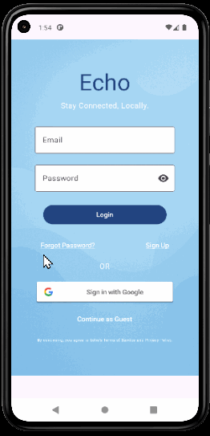
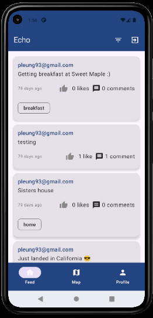
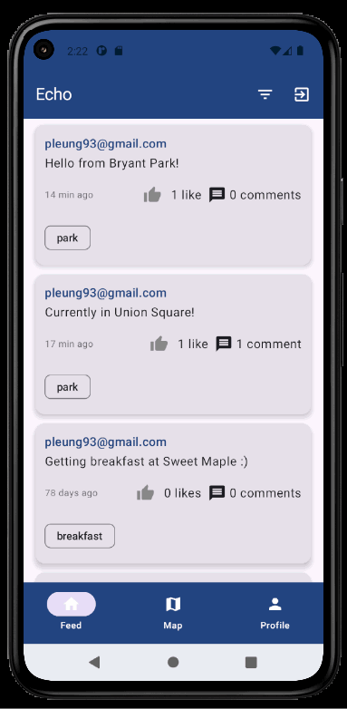
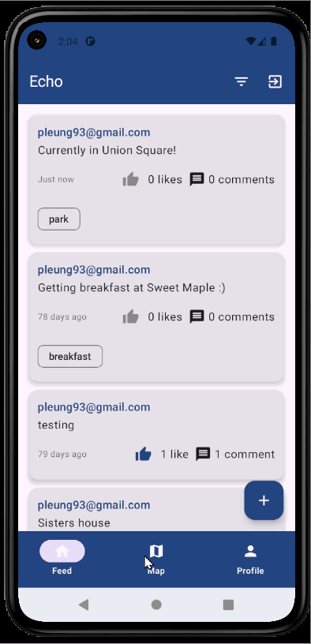
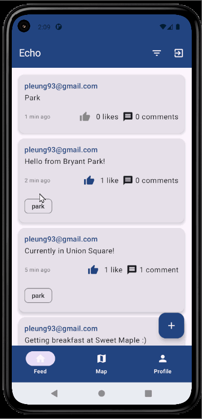
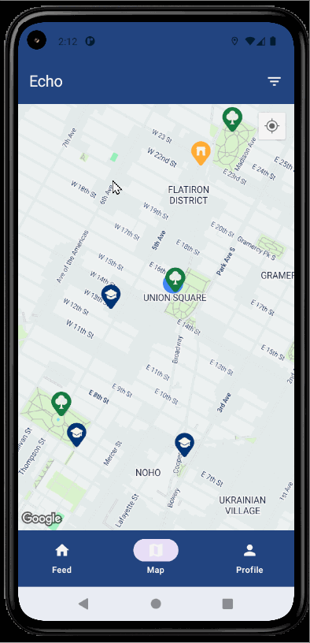

# 📍 Echo

**Echo** is a location-based social networking app built with **Kotlin** and **Jetpack Compose**.  
It blends a modern social feed with an interactive map, empowering people to share posts, discover events, and connect with others in their area.  
By focusing on **proximity and community**, Echo transforms local conversations into meaningful real-world interactions.

---

## 🎯 Overview

Echo is designed to make your neighborhood feel closer.  
Posts are tailored to your location, ensuring discussions are relevant to where you are and what’s happening around you.  
Whether you’re sharing an event, reporting an alert, or highlighting a hidden gem, Echo brings together people who are geographically close — encouraging engagement that matters.  

The app features real-time updates, tag-based filtering, and interactive Points of Interest (POIs) such as colleges, landmarks, and parks that serve as gathering points for discussion.  
Built using **clean architecture** and **Firebase-powered infrastructure**, Echo prioritizes speed, scalability, and a frictionless user experience.

---

## 🌟 Key Features

- **Login Screen**
  - Secure sign-in with **Firebase Authentication**.
  - Support for both email/password and Google sign-in.
  - Smooth transition into the app’s main feed.
    
- **Feed Screen**
  - Browse posts from users in your local area, sorted by recency or popularity.
  - Filter content by tags (e.g., `events`, `alerts`, `offers`).
  - Real-time updates ensure you see the latest activity around you.

- **Map Screen**
  - Explore posts and POIs displayed on an interactive map.
  - Filter markers by type for a customized view.
  - Location-aware: markers update based on your current position.

- **Post Details**
  - Consistent `PostCard` design showing post content, likes, comments, and tags.
  - Commenting is **proximity-based** — only available if you’re within 5km of the post’s location.

- **Points of Interest (POIs)**
  - Pre-seeded locations such as colleges, landmarks, and parks.
  - Visible to all users, with interaction limited to nearby users.

- **Post Creation**
  - Compose posts with optional map visibility.
  - Tag posts for targeted discovery in your local community.

---

## 🛠️ Tech Stack

**Frontend**
- [Kotlin](https://kotlinlang.org/) + [Jetpack Compose](https://developer.android.com/jetpack/compose)  
- [Material 3](https://m3.material.io/) for UI styling  
- [Google Maps Compose](https://developers.google.com/maps/documentation/android-sdk/compose)  
- [Coil](https://coil-kt.github.io/coil/) for image loading

**Backend**
- [Firebase Authentication](https://firebase.google.com/docs/auth) (Email & Google Sign-In)  
- [Cloud Firestore](https://firebase.google.com/docs/firestore) for data storage  
- [Firebase Storage](https://firebase.google.com/docs/storage) for image hosting  
- [GeoFire for Firestore](https://github.com/MichaelSolati/geofirestore-android) for geolocation queries

**Utilities**
- **POI Seeding Script** — Python + Firebase Admin SDK to batch insert global POIs into Firestore without per-user Places API billing.

---

## 📸 Screenshots & GIFs

### Login Screen

### Feed Screen

### Map Screen

### Post Details

### Create Post Flow (GIF)

### POI Interaction (GIF)

---

## 📄 License

This project is not licensed for use, modification, or redistribution.
