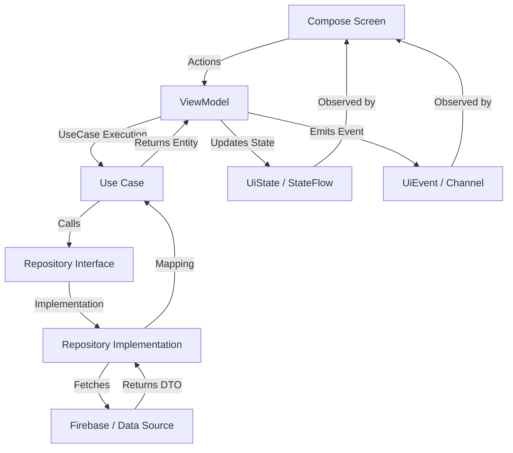
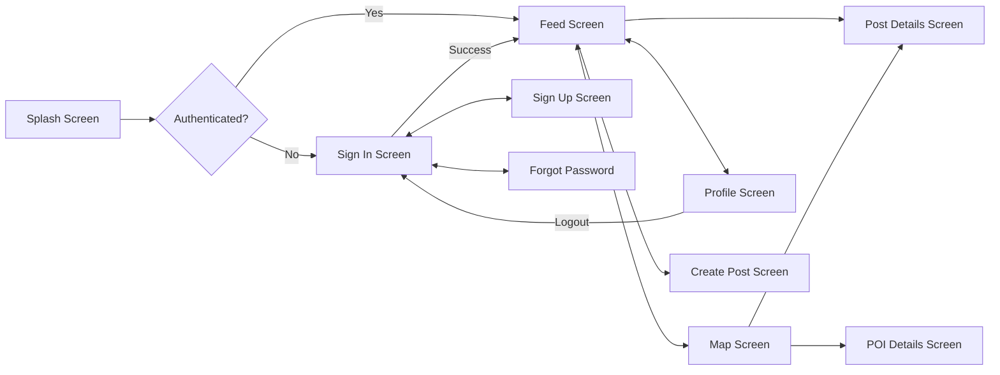

# Echo Architecture Guide (Source of Truth)

This document serves as the formal architecture specification for the **Echo** Android application. It defines the structural standards, data flow patterns, and component responsibilities to ensure scalability, testability, and long-term maintainability.

---

## 🏗️ Architecture Design Pattern

Echo follows **Clean Architecture** principles combined with **MVVM (Model-View-ViewModel)** and **Unidirectional Data Flow (UDF)**.

### 1. Layered Responsibilities

- **Presentation Layer (`:app:ui`)**
  - **Jetpack Compose**: Handles the UI rendering and user interactions.
  - **ViewModel**: Manages UI state and business logic execution. Exposes exactly one `StateFlow<UiState>` and one `Channel<UiEvent>`.
  - **UDF Pattern**: 
    - **State**: The UI observes a single source of truth for its layout.
    - **Events**: One-shot events (e.g., snacks, navigation) are consumed via Channels.
    - **Actions**: The UI calls methods on the ViewModel to trigger logic.

- **Domain Layer (`:app:domain`)**
  - **Entities**: Pure Kotlin data classes representing the business models.
  - **Use Cases**: Single-responsibility components that encapsulate specific business rules.
  - **Repository Interfaces**: Define the contracts for data operations, abstracting the data source.

- **Data Layer (`:app:data`)**
  - **Repository Implementations**: Fulfill the domain contracts using specific data sources (Firebase Firestore, Storage, Auth).
  - **DTOs (Data Transfer Objects)**: Represent the structure of data in external systems (e.g., Firestore documents).
  - **Mappers**: Transform DTOs to Domain Entities and vice versa, ensuring strict layer separation.

### 2. Data Flow (UDF)



---

## 🗺️ Screen Navigation Flow

The application uses **Type-safe Jetpack Compose Navigation**.



---

## 📂 File Tree

```text
app/src/main/java/com/example/echo/
├── data/
│   ├── mapper/          # Transformation logic between layers
│   ├── model/           # DTOs (e.g. PostDto, UserDto)
│   └── repository/      # Repository implementations (Firebase)
├── di/                  # Hilt modules (Firebase, Repository, UseCase)
├── domain/
│   ├── model/           # Business entities (Post, User, Comment)
│   ├── repository/      # Repository interfaces
│   └── usecase/         # Domain-driven business logic
├── navigation/          # Compose Navigation setup and routes
├── ui/                  # Presentation layer
│   ├── auth/            # Sign In, Sign Up, Forgot Password
│   ├── common/          # Reusable UI components (BottomBar, SnackBar)
│   ├── create/          # Post creation flow
│   ├── feed/            # Main social feed
│   ├── maps/            # Interactive map view
│   ├── poi/             # POI detail view and proximity-gated comments
│   ├── post/            # Detailed post view and interactions
│   ├── profile/         # User profile and settings
│   ├── splash/          # App entry and session check
│   └── theme/           # Design system (M3, Colors, Typography)
└── utils/               # App-wide helpers (Constants, DateUtils)
```

---

## 📝 File Registry

### 🎨 Presentation Layer
| File | Responsibility |
| :--- | :--- |
| `FeedViewModel.kt` | Manages state and events for the Feed screen using UDF. |
| `FeedScreen.kt` | Main UI entry point for browsing local posts. |
| `MapViewModel.kt` | Logic for filtering and preparing POIs for map rendering. |
| `MapScreen.kt` | Interactive map interface for location-based discovery. |
| `AuthViewModel.kt` | Centralizes authentication logic and user session management. |
| `CreatePostScreen.kt`| UI for composing and tagging new community posts. |

### 🧠 Domain Layer
| File | Responsibility |
| :--- | :--- |
| `Post.kt` | Pure business model representing a social post. |
| `User.kt` | Entity representing a user profile within the system. |
| `Poi.kt` | Model representing a Point of Interest (College, Park, Landmark). |
| `PostRepository.kt` | Interface defining post-related operations (fetch, create, like). |
| `GetPostsUseCase.kt` | Logic for retrieving a stream of posts for the feed. |

### 💾 Data Layer
| File | Responsibility |
| :--- | :--- |
| `PostDto.kt` | Data structure representing the Firestore document for a post. |
| `PostMapper.kt` | Static logic to convert between `PostDto` and `Post`. |
| `PostRepositoryImpl.kt` | Firebase-specific implementation of the post repository. |
| `PoiRepositoryImpl.kt` | Real-time synchronization of POI data from Firestore. |

### 🛠️ Foundation & Support
| File | Responsibility |
| :--- | :--- |
| `NavGraph.kt` | Orchestrates screen transitions and argument passing. |
| `Constants.kt` | Centralized storage for navigation routes and Firebase keys. |
| `FirebaseUtils.kt` | Helpers for common Firebase operations and timestamp conversions. |

---

## ⚙️ Engineering Constraints

1.  **Strict Layer Separation**: The Presentation layer never interacts with DTOs. Data must be mapped to Domain Entities before reaching ViewModels.
2.  **UDF Integrity**: Every ViewModel exposes a `uiState: StateFlow` and a `uiEvent: Flow` (via Channel).
3.  **Zero Hardcoding**: All user-facing strings are strictly managed in `res/values/strings.xml`.
4.  **Hilt Injection**: All dependencies are provided via Hilt, including UseCases and Repositories.
5.  **Dispatcher Management**: Use standard `CoroutineDispatchers` injected via DTO for testability.
